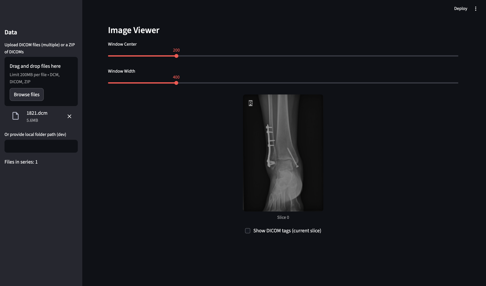

# dicom-mini-viewer

### This project includes a lightweight Streamlit-based DICOM viewer that can:
### - Upload a file (zipped or multiple files) of DICOMs
### - Display series and images with simple window/level controls

The programming language that was used is Python, along with modules like streamlit and pydicom among others.
The program runs locally in a web browser.

